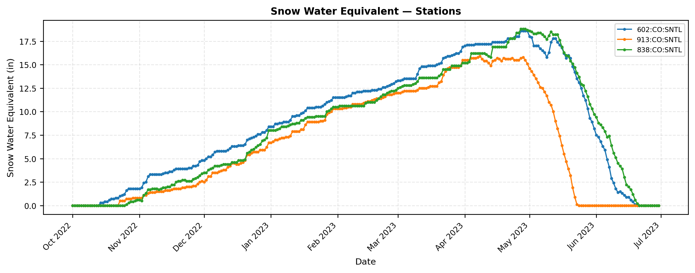

# snotelpy

Snotelpy is a lightweight Python Package interface for accessing USDA SNOTEL station data, allowing researchers to quickly retrieve, filter, and analyze snowpack variables across all SNOTEL stations and watersheds via the NRCS AWDB RESTful API.

---

## Motivation
I built this package as there is currently no actively maintained, modern Python package built on the newer [NRCS AWDB RESTful API](https://wcc.sc.egov.usda.gov/awdbRestApi/swagger-ui/index.html). The previous WSDL/SOAP API used to request SNOTEL data is being transitioned away to the newer AWDB RESTful API.

`snotelpy` fills this gap - giving researchers a simple, Python interface to fetch, filter, and analyze snowpack data from SNOTEL stations without manually constructing API URLs or cleaning raw JSON responses. 

---

## Installation
```bash
 pip install --index-url https://test.pypi.org/simple/ \
    --extra-index-url https://pypi.org/simple/ \
    snotelpy

```

---

## Quick Start
```python
import snotelpy as sp 

#Fetch daily SWE and precipitation for two Colorado stations (2020 water year)
ds = sp.fetch_snotel(
    stations=["602:CO:SNTL", "913:CO:SNTL"],
    elements=["WTEQ", "PREC"],
    duration="DAILY",
    start_date="2019-10-01",
    end_date="2020-09-30"
)

# Print resulting xarray Dataset with (time, stations) dimensions
print(ds)


```


## Functions

### fetch_snotel(stations, elements, duration, start_date, end_date, include_coords)
Fetches one or more SNOTEL variables across one or more stations and returns
an `xarray.Dataset` with `(time, station)` dimensions. Automatically chunks large
requests that exceed the API's 500,000-point limit.


| Parameter | Type | Default | Description |
|---|---|---|---|
| `stations` | list | required | Station triplets, e.g. `["602:CO:SNTL"]`. Supports `*` wildcard. |
| `elements` | list | required | Element codes, e.g. `["WTEQ", "PREC"]`. |
| `duration` | str | `"DAILY"` | `"DAILY"`, `"HOURLY"`, `"SEMIMONTHLY"`, `"MONTHLY"`, `"CALENDAR_YEAR"`, `"WATER_YEAR"` |
| `start_date` | str | `"1991-01-01"` | Begin date in `YYYY-MM-DD` format. |
| `end_date` | str | `"2100-01-01"` | End date in `YYYY-MM-DD` format. |
| `include_coords` | bool | `False` | If `True`, attach latitude, longitude, and elevation as dataset coordinates. |

---

### get_stations(station_triplets, elements, hucs, county_name, station_name, returnStationElements, returnType)
Queries the AWDB API for stations matching the given filters and returns
a `pandas.DataFrame` or a `geopandas.GeoDataFrame` (EPSG:4326).

| Parameter | Type | Default | Description |
|---|---|---|---|
| `station_triplets` | list | `["::SNTL"]` | All SNOTEL stations by default. |
| `elements` | list | `[]` | Filter by element codes, e.g. `["WTEQ"]`. |
| `hucs` | list | `[]` | Filter by HUC watershed codes, e.g. `["10"]`. |
| `county_name` | str | `""` | Filter by county name, e.g. `"Boulder"`. |
| `station_name` | str | `""` | Filter by station name. |
| `returnStationElements` | bool | `False` | If True returns all the possible elements the request stations record. |
| `returnType` | str | `"pd"` | `"pd"` for pandas DataFrame, `"gpd"` for GeoDataFrame. |


---

### plot.element_timeseries(ds, element, show_plot, ax, figsize)

Plots a time series for a given SNOTEL element across all stations in a dataset.
Returns the matplotlib `Axes` object for further customization or embedding in subplots.

| Parameter | Type | Default | Description |
|---|---|---|---|
| `ds` | xarray.Dataset | required | Dataset returned by `fetch_snotel()`. |
| `element` | str | `"WTEQ"` | Element code to plot, e.g. `"WTEQ"`, `"SNWD"`, `"TAVG"`. |
| `show_plot` | bool | `True` | If `False`, suppresses `plt.show()` for embedding in subplots or saving. |
| `ax` | matplotlib.axes.Axes | `None` | Axes to plot onto. If `None`, a new figure is created. |
| `figsize` | tuple | `(10, 4)` | Figure size in inches. Only used when `ax` is `None`. |

**Basic usage:**
```python
ds = sp.fetch_snotel(
    stations=["602:CO:SNTL", "913:CO:SNTL"],
    elements=["WTEQ"],
    start_date="2022-10-01",
    end_date="2023-03-31"
)
ax = sp.plot.element_timeseries(ds, element="WTEQ")
```

**Embedding in a subplot:**
```python
fig, axes = plt.subplots(2, 1, figsize=(10, 8))
sp.plot.element_timeseries(ds, element="WTEQ", show_plot=False, ax=axes[0])
sp.plot.element_timeseries(ds, element="SNWD", show_plot=False, ax=axes[1])
plt.tight_layout()
plt.show()
```

---

## Common Element Codes

| Code | Description | Units |
|---|---|---|
| `WTEQ` | Snow Water Equivalent | in |
| `PREC` | Precipitation Accumulation | in |
| `SNWD` | Snow Depth | in |
| `TAVG` | Air Temperature Average | °F |
| `TMAX` | Air Temperature Maximum | °F |
| `TMIN` | Air Temperature Minimum | °F |

See `ELEMENTS.yaml` for all elements supported in the NRCS networks, note -- SNOTEL doesn't support most of these elements. 

---

## Examples
See the [Examples notebook](Examples.ipynb) for complete workflows including:
- Single-station SWE time series
- Multi-station HUC-filtered requests
- Elevation vs. SWE scatter plots
- GeoDataFrame mapping

---

## Data Source

Data is sourced from the
[USDA NRCS Air-Water Database (AWDB) REST API](https://wcc.sc.egov.usda.gov/awdbRestApi/swagger-ui/index.html).

---

## Planned Extensions

- SCAN (Soil Climate Analysis Network) support

---

## License

MIT License — see [LICENSE.txt](LICENSE.txt)
