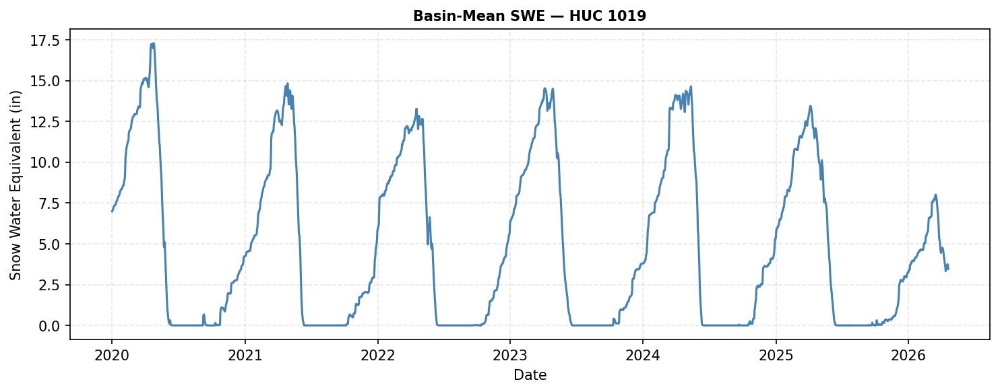

# snotelpy

**A modern Python interface for USDA SNOTEL data.**

[](https://pypi.org/project/snotelpy/)
[](LICENSE.txt)

---

## Why snotelpy?

The NRCS is transitioning away from the legacy WSDL/SOAP API toward a modern 
RESTful interface. No actively maintained Python package exists for it yet.
`snotelpy` fills that gap — clean xarray Datasets, automatic chunking for large 
requests, and built-in spatial filtering by HUC watershed, county, or station name.

---

## Install

```bash
pip install snotelpy
```

---

## Quick Example

```python
import snotelpy as sp

ds = sp.fetch_snotel(
    stations=["602:CO:SNTL", "913:CO:SNTL"],
    elements=["WTEQ", "SNWD"],
    start_date="2022-10-01",
    end_date="2023-06-30"
)

sp.plot.element_timeseries(ds, element="WTEQ")
```


---

## Basin Summary Example

```python
out = sp.basin_summary(
    hucs=[1019],
    elements=["WTEQ"],
    duration="MONTHLY",
    start_date="2000-10-01",
    end_date="2025-10-01",
    climatology_period=("2000-10-01", "2025-10-01")
)

# Basin-averaged SWE statistics (MEAN, MEDIAN, MAX, MIN) x time
print(out["basin_stats"])

# Monthly climatology
print(out["climatology"])

# All stations in the basin as a GeoDataFrame
print(out["stations"].head())
```



---

## What you can do

- **Fetch** daily, hourly, or monthly data for any SNOTEL station or wildcard
- **Filter** stations by HUC watershed, county, or element availability
- **Summarize** entire basins with mean, median, max, min, and monthly climatology
- **Plot** multi-station time series with one line
- **Save** directly to NetCDF, GeoJSON, or .CSV

---

## Data Source

Data is retrieved live from the 
[USDA NRCS AWDB REST API](https://wcc.sc.egov.usda.gov/awdbRestApi/swagger-ui/index.html).

---

## Full API Reference

See the [API docs](api/fetch.md) for complete parameter documentation.